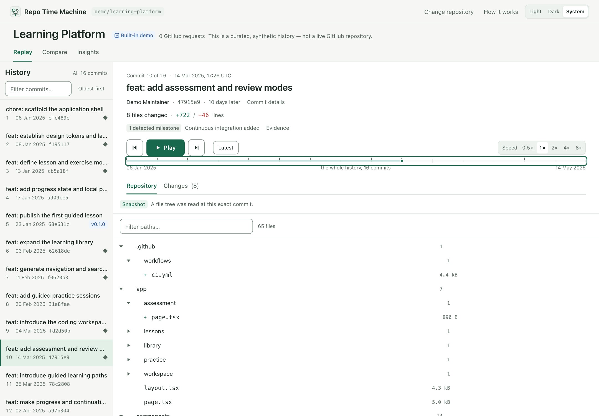

# Repo Time Machine

See how a repository took shape: step through its commits, inspect what each one
changed, and compare any two points.

There are two ways in:

- **the built-in demo** — a curated sixteen-commit history that needs no GitHub
  account and makes no GitHub requests;
- **any public GitHub repository** — paste `owner/repository` or a URL and it
  reads the default branch through GitHub's REST API.

Either way, the tool reconstructs the file tree at each commit and lets you step
or play through the history while the tree fills in, files change, and the commit
detail follows along.



*The built-in demo at commit 10 of 16 — the history on the left, and on the right the commit, a one-line summary of what it changed, the player, and the file tree as it stood at that point. The line under the title reads `Built-in demo · 0 GitHub requests`, because this history ships with the app.*

It answers questions that are awkward to answer on GitHub itself:

- what existed at the beginning;
- which files and folders appeared next;
- when a framework or an architecture became visible;
- what a particular commit actually changed;
- which parts of the repository were busy at which times;
- how a handful of files turned into an application.

No login. No cloning. Public repositories only.

## Three views

One question at a time, chosen from the tabs under the repository's name.

| View | The question it answers |
| --- | --- |
| **Replay** | What did this repository look like at this commit, and what did this commit change? |
| **Compare** | What is different between these two points? |
| **Insights** | How did the size and the structure change across the loaded history? |

`Replay` is two columns: the commit history on the left, and on the right the
selected commit, the player, and one of two sub-views — `Repository` for the
file tree as it stood there, `Changes` for the diff. Both sub-views sit under the
same heading and the same player, so moving between them never loses your place.

Arriving on a repository puts the playhead on the **earliest commit in the loaded
range**, paused. Stepping forward from the start is the point of the tool;
arriving at the finished repository shows a result instead. A link that names a
commit always wins over that default, and `Latest` is one click away.

---

## Why it exists

Reading a repository's history usually means paging through a commit list, which
tells you what happened but not what the project *looked like* at the time. The
useful question is often "what did this become, and when" — and that is a
question about the tree, not about the log.

This is also a portfolio project, so it is deliberately built to be honest about
what it knows. GitHub's API does not hand out a cheap answer to "what did the
tree look like at commit N", and most tools that claim to show it are quietly
guessing. This one says which parts it measured and which parts it inferred.

## The built-in demo

`Learning Platform` is a curated sixteen-commit history describing how a learning
product might plausibly grow: a shell, then design tokens, then models, lessons,
practice, a coding workspace, learning paths, a dashboard, and finally a pass for
responsive layout and accessibility.

It is **synthetic**. The commits, authors, object ids, file paths and diffs are
invented; nothing is copied from, or reproduces, any real repository. It exists so
the tool can demonstrate itself without reading anybody's account.

Because it ships with the application:

- it makes **zero GitHub requests** and needs no token;
- it is identical for every visitor, so a shared link always shows the same thing;
- every position in the replay is **exact**, because a full tree is stored for all
  sixteen commits.

The interface says which mode you are in, in one place, under the repository's
name. Built-in data reads `Built-in demo · 0 GitHub requests`, the GitHub usage
disclosure is hidden entirely, and commits show their sha as plain text rather
than as a link, because there is no repository to open.

"GitHub requests", not "API requests": the browser does call this application's
own routes for the demo. It never calls GitHub. And the mode comes from the
server's `dataSource` field, never inferred from the slug you typed — until that
answer arrives the line reads `Loading source…` rather than claiming a live
repository it has not yet reached.

### Why it replaced a list of real projects

Earlier versions shipped a demo list of the author's own repositories. That put
personal project names, file trees and commit messages into the product, the
fixtures, the tests and the documentation for no functional reason. One synthetic
history does the same job without exposing anything.

Earlier public commits still contain those references; this change removes them
from the current tree rather than rewriting history.

## Live GitHub mode

Enter `owner/repository`, a GitHub URL, or a clone URL. Everything documented
below — loaded ranges, tree reconstruction, caching, rate limits, milestones —
applies to this mode. The built-in demo is served locally and bypasses all of it.

`demo` is a reserved internal namespace, not a GitHub account. Exactly one
reference in it resolves — the built-in demo — and every other `demo/*` reference
is refused locally with the ordinary 404, before any GitHub request is built. It
is never silently swapped for the demo that does exist.

Because no request goes out, those responses carry `rateLimit: null` and
`rateLimitAgeMs: null` rather than the snapshot left by some earlier live request.
Owners that merely resemble the reserved one — `demos`, `my-demo` — are real
accounts and go down the ordinary GitHub path.

## What "loaded history" means

This is the part most similar tools are vague about, so it is stated everywhere
in the interface.

The replay covers a **contiguous range of commits ending at the tip of the
default branch**. On load, up to the latest **300 commits** are fetched (three
pages of 100). If the repository has fewer than that, the whole history is
loaded; if it has more, `Load 100 older commits` extends the range backwards, up
to a hard ceiling of 1,000 per session.

The range is stated in two places, in two different words, because they answer
two different questions:

| Where | Full history | Partial history |
| --- | --- | --- |
| The history list, "how long is this list" | `All 64 commits` | `Latest 300 of 1,204 commits` |
| Under the player, "does the track start at the beginning" | `the whole history, 64 commits` | `part of the history, 300 of 1,204 commits` |

Consequences worth knowing:

- For a large repository, commit 1 in the replay is **not** the repository's
  first commit. It is the oldest commit currently loaded, and `Insights` says so
  before any figure that depends on it.
- Only the default branch is read. Work that lives on other branches is invisible
  unless it was merged.
- Commit counts come from GitHub's pagination header, so they are exact rather
  than estimated — but they count the default branch only.

## How the file tree is reconstructed

GitHub offers two relevant primitives, and neither one alone is enough:

| Request | Cost | What it gives |
| --- | --- | --- |
| `GET /repos/{o}/{r}/git/trees/{sha}?recursive=1` | 1 request | The **exact** file list at one commit. |
| `GET /repos/{o}/{r}/commits/{sha}` | 1 request | The **exact** diff of one commit. |

Fetching a tree per commit would be one request per frame of playback, which is
untenable. So the application reads full trees at a bounded number of
**checkpoint commits** spread across the loaded range, and fetches per-commit
diffs in the background. Any position in the replay is then *"the nearest
checkpoint at or before here, plus every diff since"*.

The tree panel states which case it is in:

- **`exact`** — a tree was read at this very commit.
- **`rebuilt`** — a checkpoint plus a complete, unbroken chain of diffs. Also exact,
  just assembled rather than read.
- **`≈ n gaps`** — a checkpoint plus diffs, with `n` commits in between whose diffs
  have not loaded yet. Click it to jump to the checkpoint it was built from.

When you stop on a commit, one extra tree request upgrades that position to
`exact`. That deliberately does not happen during playback.

### Limitations of this approach

- **Between checkpoints, before the diffs arrive, the tree lags.** It is the
  checkpoint's tree, not this commit's. The badge says so; it is never presented
  as certain.
- **Files known only from a diff have no size.** A tree response carries blob
  sizes; a diff does not. Those files show no size, and byte-based statistics say
  they are partial.
- **Very large repositories get truncated trees.** GitHub truncates a recursive
  tree above roughly 100,000 entries or 7 MB and sets a flag. The application
  passes that flag through as a notice rather than silently showing a short list.
- **A commit's file list is capped at 300 by GitHub.** Commits that touch more
  files show the first 300 with a note.
- **Rename detection is GitHub's.** A rename is shown as the old path leaving and
  the new path arriving, with "renamed from …" recorded.
- **No submodules.** Submodule pointers are dropped from the tree.
- **Force-pushes and rewritten history** are invisible: the API only reports the
  branch as it stands now.

## Comparing two points

`Replay` answers *what did this commit do*. `Compare` answers *what is different
between these two points*, which is not the same question: it needs the net
difference, not the sum of the commits in between.

The two ends are `From` and `To`, equally weighted, with `base` and `head` in
small print — those words are the answer to a question a newcomer has not asked
yet. Either end can be a tag or any commit in the loaded range.

**Choosing the ends and reading the answer are two steps.** Moving a selector
costs nothing; pressing `Compare` is what spends a request. Without that split, a
visitor adjusting both ends pays for a comparison nobody wanted to see — and an
old result would end up sitting under new endpoints. Whenever the selection and
the loaded result disagree, the result is put away rather than relabelled.

Opening it from the replay proposes a pair and runs it once: the step before the
current commit and the current commit. At the very first commit there is no step
before it, so the proposal is the whole loaded range instead — never a commit
compared with itself, which would answer nothing.

What the result shows:

- the relation (`ahead`, `behind`, `identical`, `diverged`) as a sentence whose
  subject is the end that moved, plus the file and line totals;
- one row of three figures — changed files, lines added, lines removed;
- `File changes`, the net per-file difference with expandable diffs;
- `Commits`, the commits between the two points, each with `Open in Replay`;
- `Repository stats`, the two ends measured against each other — file counts,
  tracked bytes, top-level folders, which folders appeared or disappeared, and
  the file-type mix on a shared colour scale.

Swapping the ends changes the selection; running it reads the difference
backwards and says `behind`. Two ends that name the same commit are answered
without a request at all. A comparison that has actually run owns the address bar
(`?repo=…&base=…&head=…`), so a link opens straight into it — and choosing
endpoints never moves the replay, which only `Open in Replay` does.

### Where the numbers come from

For a live repository, one request to GitHub's compare endpoint returns the
relation, the commits and the net file list together. It is addressed by two
shas, so the result never changes and is cached for a day. The payload has one
gap — it describes `base_commit` but never a head commit, and when head is an
ancestor of base the commit list is empty — so a second very small request
identifies head rather than leaving a bare sha on screen.

For the built-in demo, and for the recorded fixtures, the comparison is computed
locally. Where a tree is known at both ends the net difference is read off those
two trees rather than replayed from diffs, which stays exact however many times a
file was touched in between. Where a tree is missing at one end it falls back to
the loaded diffs and says the file list is incomplete.

### What it does not do

There is no generated summary of a comparison. Every number is counted from a
tree or a diff, and anything that cannot be counted says so instead of being
estimated into a sentence.

One consequence is worth stating plainly: a diff is only attached to a net change
when exactly one recorded hunk **is** that change. If a file was touched more
than once between the two points, no single hunk describes the difference, so the
file reports `changed more than once` and shows only the summed line counts.
Showing one commit's hunk as the whole change would be wrong.

## Sharing and the address bar

The whole visible state is in the query string, so any view can be linked to.

| Parameter | Meaning |
| --- | --- |
| `repo` | `owner/repository`, or a GitHub URL, validated before anything is fetched |
| `c` | the selected commit, full or abbreviated sha |
| `base`, `head` | the two ends of a comparison |
| `view` | `insights`; `replay` is the default and so is left off |

A pair of endpoints *is* what makes a link a comparison, named or not, which is
what keeps every link handed out before `view` existed working exactly as it did.
An unrecognised `view` falls back to the replay rather than failing, and `view`
alone cannot open an empty comparison.

Only a comparison that has actually run appears in the URL — a draft describes
nothing, so there is nothing to share. Deliberate acts push a history entry, so
Back undoes the thing that was just done; playback replaces, so a minute of
playing does not bury the entry the visitor arrived on.

## GitHub API architecture

```
browser ──same-origin fetch──▶ Next.js route handler ──▶ api.github.com
             (JSON)                  (holds the token)
```

The browser never talks to GitHub. Every request goes through a route handler
under `/api/gh/*`, which means the token stays on the server and the Content
Security Policy can restrict `connect-src` to `'self'`.

Every response carries `meta.dataSource`, which is `builtin` or `github`. The
interface switches on that field rather than on any visible label, so it can never
be wrong about which mode it is in.

The reserved-namespace rule is applied where a request's parameters become a
reference (`readRepoRef` in `src/lib/api/route-helpers.ts`, which all six routes
call) and again where the service decides between the fixture and GitHub
(`servedFromBuiltin` in `src/lib/github/service.ts`). One predicate, enforced at
both boundaries, so no endpoint can be given it separately and no direct API
request escapes it.

A failure decided locally reports no GitHub quota. The rate-limit store holds
whatever the last real response said, and attributing those numbers to a call that
never happened would imply quota was spent and date the reading to now. Genuine
GitHub failures still report theirs.

| Route | GitHub endpoint | Cache |
| --- | --- | --- |
| `/api/gh/repo` | `/repos/{o}/{r}` | 300s |
| `/api/gh/commits` | `/repos/{o}/{r}/commits` | 300s |
| `/api/gh/commit` | `/repos/{o}/{r}/commits/{sha}` | 86400s |
| `/api/gh/tree` | `/repos/{o}/{r}/git/trees/{sha}?recursive=1` | 86400s |
| `/api/gh/tags` | `/repos/{o}/{r}/tags` | 600s |
| `/api/gh/probe` | `/repos/{o}/{r}/commits?path=…` | 3600s |

A domain adapter (`src/lib/github/adapter.ts`) maps REST payloads to the types in
`src/lib/domain/types.ts`. Nothing above that layer sees a raw GitHub response,
so the UI does not depend on the shape of GitHub's JSON.

### Request budget for one repository view

| Data | Requests |
| --- | --- |
| Repository metadata | 1 |
| Commit list | 1 per 100 commits, 3 pages automatically |
| Exact commit count | 1 (`per_page=1`, read from the `Link` header) |
| Tags | 1 |
| Tree checkpoints | up to 10 with a token, 3 without |
| Commit diffs | background: up to 400 with a token, 12 without |
| Milestone path probes | up to 10, only with a token |

None of it applies to the built-in demo, which is served locally.

Four rules keep it in bounds:

- **The first usable screen is the selected commit.** Metadata, then the commit
  list, then that commit's tree and diff — concurrently. Tags, remaining
  checkpoints, background diffs and milestone probes all queue behind it.
- **Nothing is fetched per commit during the initial load.**
- **Trees are only read where diffs cannot reach.** If every diff in the range is
  going to be loaded anyway, a baseline tree plus the selected one already makes
  every position exact, so no further trees are requested. A five-commit
  repository therefore costs two tree reads, not five.
- **Background work stops** when the observed remaining quota drops below a floor
  (60 authenticated, 12 anonymous), and is **cancelled outright** when the visitor
  switches repository.

### Caching

Three layers, each doing a different job:

1. **Next.js data cache** (server). `fetch(..., { next: { revalidate } })`. Because
   commit diffs and trees are addressed by sha they are immutable, so they are
   cached for a day; listings for five minutes. A second visitor opening the same
   repository mostly costs nothing.
2. **HTTP cache headers** (CDN). Responses carry
   `Cache-Control: public, s-maxage=…, stale-while-revalidate=…`, repeated as
   `CDN-Cache-Control` and `Vercel-CDN-Cache-Control` because Vercel normalises
   the standard header on route handlers. Errors carry `no-store` on all three.
3. **In-memory LRU with in-flight de-duplication** (browser). Scrubbing back and
   forth never refetches. Concurrent callers asking for the same commit share one
   request. Nothing is written to `localStorage` — GitHub payloads are far too
   large for it, and a stale copy would outlive a force-push.

## Rate limits

GitHub allows **60 requests per hour per IP** without a token and **5,000 per
hour** with one. The application works either way; without a token it loads fewer
trees and fewer diffs and says so in the interface.

The header shows the quota **as last observed**, not as of now. That wording is
deliberate: a response replayed from the data cache carries the rate-limit headers
from when it was first fetched, so presenting the number as live would be a small
lie. Hover it for the exact age and reset time.

When the limit is reached, the error state names the limit, shows when the window
resets, explains that a self-hosted deployment can raise it with a token, and
offers the built-in demo as an alternative. Choosing it swaps the data source and
says so — the requested repository is never silently replaced with synthetic data.

## Optional token setup

A token is optional and only raises the rate limit. Repo Time Machine reads
public repositories, so it needs **no scopes at all**.

```bash
cp .env.example .env.local
# then edit .env.local
GITHUB_TOKEN=github_pat_...
```

- Classic token: create it with **no scopes ticked**.
- Fine-grained token: **Public repositories (read-only)** is enough.

The built-in demo needs **no token and no GitHub quota**, so a deployment with no
token configured still has something complete to show.

### On Vercel

```bash
vercel env add GITHUB_TOKEN production
# paste the token when prompted, then redeploy
vercel --prod
```

Or in the dashboard: **Settings → Environment Variables**, name `GITHUB_TOKEN`,
scope it to the environments you want, and leave it as a plain (server-side)
variable.

Do not prefix it with `NEXT_PUBLIC_`; that prefix is exactly what would publish it
to the browser. The variable is read only inside route handlers, is never logged,
and never appears in a response body — the e2e suite asserts the last part against
a real production build.

## Security

The one value a visitor controls is the repository reference, so that is where
the boundary is drawn.

- **`parseRepoRef` is the only way in.** It accepts `owner/repo`, GitHub web URLs
  and clone URLs; it rejects other hosts (including GitHub Enterprise and
  `raw.githubusercontent.com`), GitHub product routes such as `/settings/x`,
  path traversal, and names GitHub itself would not allow. It returns only an
  `owner` and a `repo` — never a host, a base URL, or a path fragment.
- **API URLs are assembled from a constant origin** plus URL-encoded path
  segments. `https://api.github.com` is a module constant, never a parameter.
  There is no code path that fetches a URL supplied by a visitor.
- **The token never leaves the server.** It is read inside route handlers only, is
  never logged, never embedded in HTML, and never appears in a response body. The
  e2e suite asserts this against the real production build.
- **Repository content is treated as untrusted text.** Commit messages, author
  names, file paths, patches and descriptions are rendered as React text nodes.
  There is no `dangerouslySetInnerHTML` anywhere, and `react/no-danger` is an
  error in the lint config. Repository markdown is not rendered as HTML.
- **Repository code is never executed**, never cloned, and never written to disk.
- **Limits everywhere.** 12s request timeout, 12 MB response ceiling, 12,000
  characters per patch, 240,000 per commit, 300 files per commit, 1,000 commits
  per session, 40,000 tracked files, 200-character probe paths.
- **Security headers** on every response: `nosniff`, `X-Frame-Options: DENY`,
  `Referrer-Policy: strict-origin-when-cross-origin`, and a CSP that limits
  `connect-src` to `'self'` and forbids framing.

## Milestone heuristics

`Insights` lists the commits that look structurally interesting, and the replay
notes them in one compact line on the commit they belong to. Every entry states
the rule that fired and the evidence, because these are pattern matches —
**they do not know what anyone intended.**

Several rules routinely match the same commit, so the list is grouped by commit
and says so: "15 milestones across 9 commits". A milestone count is not a count
of commits, and neither is a count of project phases.

Rules that need only commit metadata, so they always apply:

| Milestone | Rule |
| --- | --- |
| Initial commit | The commit has no parent. |
| Merge commit | The commit has more than one parent. |
| Marked breaking | The message uses the Conventional Commits `!` marker or a `BREAKING CHANGE:` footer. |
| Revert | The subject begins with "Revert". |
| Tagged *x* | A Git tag points at this commit. |

Rules that read file paths:

| Milestone | Rule |
| --- | --- |
| First README | A `README(.md/.rst/.txt)` appears at the repository root. |
| First package manifest | A dependency manifest appears (`package.json`, `pyproject.toml`, `go.mod`, `Cargo.toml`, …). |
| Dependencies pinned | A lockfile appears. |
| Framework configuration added | A recognised framework or bundler config appears. |
| TypeScript introduced | `tsconfig.json`, or the first `.ts`/`.tsx` file. |
| First test | A `*.test.*`, `*.spec.*`, or a `tests/`, `__tests__/`, `e2e/` directory. |
| Continuous integration added | `.github/workflows/*`, `.gitlab-ci.yml`, `.circleci/*`, … |
| Deployment configuration added | `Dockerfile`, `vercel.json`, `netlify.toml`, `fly.toml`, … |
| License added | A `LICENSE`/`COPYING` file at the root. |
| Structural change | At least three top-level directories appear for the first time in one commit. |
| *Language* appears | A file extension mapped to that language is added for the first time in the range. |
| Unusually large change | Changed lines are at least 4× the median of the commits inspected, and at least 400. |

Each path milestone also reports **how sure it is about the position**:

- **exact** — a diff we hold adds a matching path in this commit;
- **confirmed by path history** — GitHub's path-scoped commit listing named the
  commit that first touched the path;
- **narrowed to commits X–Y** — we only know it happened somewhere in that range,
  because the diffs in between are not loaded. It is anchored at the earliest
  commit it could be, and drawn faintly on the player's track.

### Limitations of the heuristics

- **A file's first appearance is not the same as a decision.** `package.json`
  appearing tells you a manifest exists from then on, nothing more.
- **The lists are finite.** A framework not in the table produces no milestone.
  The rules are in `src/lib/milestones/signatures.ts` and are meant to be read.
- **Path probes follow the file as it exists at HEAD.** If a signature file was
  renamed, the probe finds the current path's history, not the original's.
- **"Unusually large" is relative to what has been inspected.** Load more diffs
  and the median moves, so the set can change.
- **`Marked breaking` reports a label, not an analysis.** Nothing checks whether
  anything actually broke.
- **Language detection is extension-based.** A `.ts` file appearing is not proof
  that a project "moved to TypeScript".

## Statistics

`Insights` is a page, read downwards: the scope of the loaded range first, then
cumulative file count and per-commit churn, then the milestones, then an
estimated file-type mix and where work happened. Nothing on it describes the
repository as a whole — only the commits that are loaded, which the summary at
the top states before any figure appears.

Every part is labelled with what it is:

- **File count** is drawn solid where the diff chain is complete and **dashed**
  where a count is carried forward from a checkpoint because the diffs in between
  have not loaded.
- **Churn bars** are drawn only for commits whose diff is loaded. Commits without
  one get a flat marker, not a zero.
- **File-type mix** is an *estimate*. It counts files by extension, skips binary
  and generated paths (lockfiles, `node_modules`, build output, minified files),
  and reports how many it excluded and how many it could not classify. It is not
  GitHub's Linguist and does not read file contents.
- **Byte totals** cover only files that came from a tree snapshot, and say so when
  they are partial.
- **Where work happened** attributes changed files to their top-level directory in
  time buckets, and states how many diffs it was built from.

- **The horizontal axis is commit order, not elapsed time.** Points are evenly
  spaced whether two commits are a minute or a year apart, and the axis says so
  rather than letting the spacing imply the other reading. The dates at each end
  are shown alongside it.

Charts have a text alternative: the growth chart has a "Read this chart as a
table" disclosure with the sampled values, and every chart carries a descriptive
`aria-label`. Hovering is never the only way to a value.

Chart colours come from the theme tokens, so the charts follow the light and dark
palettes with the rest of the interface. A file type keeps the same colour
wherever it appears, because the mapping is derived from the name rather than
from its position in the current ranking.

## Accessibility

- The scrubber is a real `<input type="range">`, so it comes with keyboard
  support, touch dragging and assistive-technology semantics. Its `aria-valuetext`
  reads out the commit number, date and subject.
- Keyboard controls: `Space`/`k` play-pause, `←`/`→` step, `Shift+←`/`Shift+→`
  jump ten, `Home`/`End` ends of range, `[`/`]` speed, `/` focus the path filter.
  Shortcuts stand down while a text field has focus.
- Focus is never trapped. A skip link is the first thing in the tab order.
- `prefers-reduced-motion: reduce` replaces transitions with immediate state
  changes — every duration token collapses to 1ms and looping animations are
  switched off rather than merely shortened. Playback itself still works.
- Change states are conveyed by more than colour: every marker carries a symbol
  (`+`, `−`, `→`, `~`), deleted paths are struck through, each changed file states
  its status in words, and tree rows carry visually hidden text such as
  "added in this commit".
- The three views and both sets of sub-views are proper tab lists.
- Dialogs and the narrow-screen history drawer close on `Escape`, keep focus
  inside while open, lock the page behind them without losing its scroll
  position, and return focus to whatever opened them.
- Playback shortcuts belong to the replay: they stand down in another view, while
  a text field has focus, and while a modal is open.
- Contrast is measured rather than eyeballed. Every text role was checked against
  every surface it is used on, in both themes: 24 pairs, all at or above 4.5:1
  for text and 3:1 for controls, borders, focus rings and chart strokes. The
  tightest is the control border at 3.11:1 against the page.
- Controls are 40px tall, 44px where the pointer is coarse.
- Text sizes stop at 12px. Limitations are never delegated to smaller type.
- No horizontal scrolling at 1440, 1280, 1024, 390 or 360px, checked by an
  assertion rather than by eye. Only a diff box and the comparison's statistics
  table scroll sideways, and each does so within its own named container.

### Themes

Light, Dark and System. Light is the default for a visitor whose system has no
preference; `System` writes no attribute at all, so the palette keeps following
the operating system with no JavaScript involved. An explicit choice is stored
and applied by a tiny inline script before the first paint, so the other theme
never flashes. Dark is its own palette rather than an inversion — its reading
surface is *lighter* than its page, which an inverted light theme gets backwards.
Changing the theme fetches nothing and reloads nothing.

## Performance

Explicit goals, and how they are met:

| Goal | How |
| --- | --- |
| The shell paints before any GitHub data | The page is static; the client reads the address bar in an effect and fetches after mount. An e2e test asserts zero API calls on the landing screen. |
| No thousands of DOM nodes | Both the file tree (34px rows) and the commit history (64px rows) are virtualised at a fixed row height, with a `maxRows` ceiling on the tree. Row heights are fixed in the stylesheet and matched by the measurement, so a subject that would wrap is truncated with the full text in the heading rather than left to desynchronise the arithmetic. |
| No repeated fetching | LRU plus in-flight de-duplication in the browser, plus the Next.js data cache on the server. Trees GitHub refused are remembered so they are not retried. |
| Sequential playback stays cheap | Tree projections are cached per commit index and each step reuses the previous one, so stepping forward is O(1) amortised rather than replaying the whole range. |
| No blocking work every frame | Playback is one `setInterval` tick per commit (850ms at 1×, floored at 90ms at 8×). Scroll handlers coalesce into one state update per frame. |
| No layout shift | The loading state reserves height, and panel widths are fixed by the grid rather than by content. |
| No hydration warnings | The server renders the idle shell; nothing reads `window` during render. |
| Few client dependencies | Runtime dependencies are `next`, `react`, `react-dom`, and `server-only`. Charts are hand-written SVG; virtualisation is about forty lines. |
| No large payloads in `localStorage` | One key, `rtm-theme`, holding one of three words. Nothing else. |
| No webfont in front of the first pixel | System sans and system monospace. There is no font to download. |
| Interaction does not mean a request | Switching view, switching sub-view, opening a diff, expanding evidence and changing the theme all fetch nothing. Measured: see below. |

### Requests for one session

Counted with the browser's own network log against a production build, built-in
demo, one repository view (`0` of them reach `github.com`):

| Step | Requests to this application |
| --- | --- |
| Initial load, fully settled | 45 — `repo` 1, `commits` 1, `commit` 16, `tree` 16, `tags` 1, `probe` 10 |
| Sub-views, opening a diff, `Insights`, changing the theme twice | **+0** |
| Opening `Compare` (runs the proposed pair once) | +1 |
| Moving both endpoint selectors and pressing Swap | **+0** |
| Pressing `Compare` | +1 |

The initial figure is the same as before this interface was rewritten, endpoint
by endpoint. The two rows in bold are the ones that changed: drafting a
comparison used to cost one request per pick and per swap.

## Testing

```bash
npm run typecheck   # tsc --noEmit
npm run lint        # eslint
npm test            # vitest, no network
npm run test:e2e    # production build + playwright, no network
npm run verify      # all four, in order
```

**No test in the standard suite touches the network.**

### Unit and integration (Vitest)

Deterministic, fixture-driven coverage of: URL and `owner/repo` parsing including
non-GitHub hosts and traversal attempts; the REST-to-domain adapter including
truncated, binary and missing patches; tree reconstruction including renames,
deletions and partial diff coverage; commit ordering and pagination boundaries;
the milestone rules and their three levels of positional confidence; playback
transitions; URL serialisation; the LRU and its de-duplication; and the request
budget, including stale-request cancellation on repository switch and the
rate-limit floor stopping background work.

Component tests (jsdom) cover the transport controls, the tree markers and the
patch fallbacks, including that hostile commit messages, author names, file names
and patch content render as text and create no elements.

The comparison has its own suite: the net difference read from two trees, line
counts summed across a range, a patch offered only when one hunk is the whole
difference, direction reversal, the degraded path when a tree is missing, and the
adapter's handling of a payload that cannot identify head. Its callbacks are also
tested detached from the controller, because that is how buttons receive them.

A dedicated suite pins the built-in demo: exactly sixteen commits, sixteen unique
valid object ids, chronological timestamps, a detail record and an exact tree for
every commit, a first tree that differs meaningfully from the last, every position
projectable, statistics derived through the normal `buildGrowthSeries`,
`estimateLanguages` and `buildActivityMap` paths, and no `fetch` call anywhere in
building or serving it. A second suite pins the routing: the demo never reaches
`api.github.com`, arbitrary `demo/*` references fall through to the ordinary
not-found path, and the test fixtures are unreachable unless `RTM_FIXTURE_MODE` is
explicitly set.

### End-to-end (Playwright)

Playwright runs against a **real production build**. `RTM_FIXTURE_MODE=1` makes
the route handlers serve recorded payloads from `fixtures/` instead of calling
GitHub, so the suite exercises the whole stack — routing, cache headers,
hydration, client behaviour — without depending on GitHub's availability or
spending rate limit. **No token is provided**, so the suite also proves the
anonymous path works.

Three projects: desktop, a Pixel 7 for the narrow layout, and a browser reporting
`prefers-reduced-motion: reduce`. Most specs run against the built-in demo; the
synthetic fixture repositories are used where a test is specifically about the
live GitHub path.

### Fixtures

`fixtures/` is entirely synthetic. No real account's repository metadata, file
tree or commit messages are stored there. It holds a five-commit and a
twelve-commit stand-in for live repositories, a one-commit repository, an empty
repository, a 640-commit history for the pagination paths, and directives that
make the server produce rate-limit, private-repository and timeout failures.

A detail bundle stores only what a commit-detail response adds over the list
response, and a tree for any commit is derived from the nearest recorded one plus
the diffs in between — the same reconstruction the client performs.

Regenerate with:

```bash
npm run fixtures                 # synthetic bundles only
npm run fixtures -- owner/repo   # optional, opt-in recording of a named repository
```

Recording is opt-in and must name the repository on the command line, so nothing
is captured by accident.

### Optional live smoke test

Kept separate on purpose, so the standard suite never depends on GitHub:

```bash
npm run build
npx next start -p 3311 &
RTM_BASE_URL=http://127.0.0.1:3311 npm run test:live
```

It checks the adapter against what GitHub actually returns today: ordering,
pagination totals, patch caps, tree entry types, that a malformed owner is
rejected before any request goes out, and that the built-in demo resolves locally
while an unknown `demo/*` reference does not. About ten requests.

It defaults to `octocat/Hello-World`, a public repository owned by GitHub itself.
Point it elsewhere with `RTM_LIVE_REPO=owner/repo`.

### Screenshots

```bash
RTM_FIXTURE_MODE=1 npx next start -p 3311 &
RTM_BASE_URL=http://127.0.0.1:3311 npm run screenshots
```

Writes twenty deterministic screenshots to `docs/screenshots/` (not committed) —
each view at 1440, 1280, 1024, 390 and 360px, in both themes — and reports any
horizontal overflow or console error it finds along the way. Everything it
captures comes from the built-in demo or the fixtures, so it never reads a real
repository.

## Local development

Requires Node 20.9+ (developed on Node 22).

```bash
npm install
npm run dev            # http://localhost:3000
```

The built-in demo works immediately, with no configuration. A token is optional
and only affects live GitHub mode; see
[Optional token setup](#optional-token-setup). Without one you get 60 requests per
hour, which is enough for a few repositories.

To serve the synthetic test fixtures as if they were live repositories:

```bash
RTM_FIXTURE_MODE=1 npm run dev
```

That flag is for tests and local inspection. It is never set in production, and
the built-in demo does not depend on it.

## Deployment

Deploys as a standard Next.js App Router application; it was built with Vercel in
mind but needs nothing Vercel-specific.

```bash
vercel            # preview
vercel --prod     # production
```

Configuration:

- `GITHUB_TOKEN` — optional, **server-side only**. Never prefix it with
  `NEXT_PUBLIC_`.
- `NEXT_PUBLIC_SITE_URL` — optional, used for canonical and Open Graph URLs.

There is no database and no persistent state. Every instance is stateless; the
only cache is Next.js's data cache and whatever the CDN keeps.

## Project structure

```
src/
  app/
    api/gh/*/route.ts   route handlers; the only code that talks to GitHub
    layout.tsx          metadata and the pre-paint theme script
    page.tsx            static shell
    icon.svg            favicon
    opengraph-image.tsx build-time Open Graph card
  components/
    TimeMachine.tsx     the shell: controller, URL, keyboard, which view is open
    TopBar.tsx          brand, global actions, theme control
    SourceStatus.tsx    where the data came from, and the GitHub quota
    ReplayView.tsx      commit heading, player, Repository/Changes sub-views
    HistoryColumn.tsx   the commit list (virtualised)
    TreePanel.tsx       the file tree at a commit (virtualised)
    ChangesPanel.tsx    what the commit changed
    FileChangeList.tsx  changed files and diffs, shared with Compare
    CompareView.tsx     endpoint selection and the net difference
    ComparePicker.tsx   one end of a comparison
    InsightsView.tsx    the statistics page
    Charts.tsx          hand-written SVG, driven by the theme tokens
    States.tsx          home screen, How it works, errors, empty, loading
    Overlay.tsx         the shared modal: focus, Escape, scroll lock
    controls.module.css the button, tab, field and surface primitives
  lib/
    repo-ref.ts         input parsing and validation (the security boundary)
    theme.ts            theme preference, shared by the boot script and the UI
    range.ts            how the loaded range is worded, in one place
    builtin/            the curated demo: fixture data and its local provider
    domain/types.ts     the types the UI works against
    github/             HTTP client, adapter, service, fixtures, rate-limit store
    api/                route/response contract shared by server and client
    client/             browser API layer and the history controller
    tree/               file classification, tree building, projection
    milestones/         signature paths and the detection rules
    stats/              growth, language estimate, activity map
    playback/machine.ts the pure playback reducer
    url/state.ts        URL serialisation
    cache/lru.ts        LRU with in-flight de-duplication
  styles/tokens.css     every colour, size, duration and radius, light and dark
fixtures/               recorded and synthetic GitHub payloads
scripts/                fixture recorder, live smoke test, screenshots
tests/                  Vitest
e2e/                    Playwright
```

The pieces worth reading first are `src/lib/tree/projector.ts` (how a tree is
reconstructed), `src/lib/client/history-controller.ts` (how requests are budgeted
and cancelled, and how the compare draft avoids spending them) and
`src/lib/builtin/` (the demo, and how it stays off the network).

Every colour, size and duration lives in `src/styles/tokens.css`, and every
button, tab, field and panel composes from `src/components/controls.module.css`,
so a control is the same height and the same focus treatment in every view.

## Licence

MIT. See [LICENSE](LICENSE).

Repo Time Machine is not affiliated with GitHub. It uses GitHub's public REST API
as any client would.
